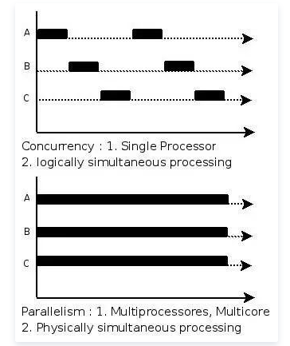
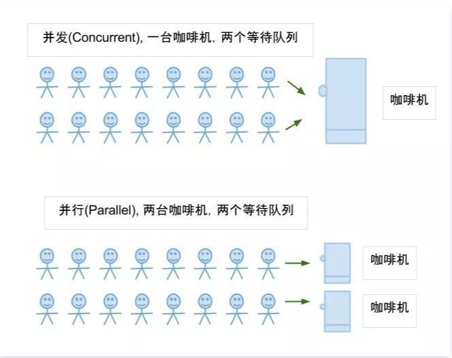

# 并发与并行的区别

**并发与并行最开始都是操作系统中的概念, 表示的是CPU执行多个任务的方式.这两个概念极容易混淆.**

**所谓"同时"进行**

我们现在使用的windows操作系统，是可以"同时"做很多件事儿的。比如我们可以一边看电影，一边聊QQ；一边听歌，一边打游戏。

但是，这所谓的"同时"，在操作系统底层可能并不是真正的意义上的"同时"。

实际上，对于单CPU的计算机来说，在CPU中，同一时间是只能干一件事儿的。为了看起来像是“同时干多件事”，Windows这种操作系统是把CPU的时间划分成长短基本相同的时间区间，即”时间片”，通过操作系统的管理，把这些时间片依次轮流地分配给各个应用使用。

这样，给用户的感觉是他在同时的进行听歌和打游戏，实际上，在操作系统中，CPU是在游戏进程和音乐播放器进程之间来回切换执行的。

操作系统时间片的使用是有规则的：某个作业在时间片结束之前,整个任务还没有完成，那么该作业就被暂停下来，放弃CPU，等待下一轮循环再继续做。此时CPU又分配给另一个作业去使用。

我们把目光聚焦在CPU的执行上，把这个过程放大的话，CPU就好像是一个电话亭。多个用户并不是同一时间在使用这个电话亭中的电话的，而是轮流使用的。

由于计算机的处理速度很快，只要时间片的间隔取得适当，那么一个用户作业从用完分配给它的一个时间片到获得下一个CPU时间片，中间有所”停顿”，但用户察觉不出来。

所以，在单CPU的计算机中，我们看起来“同时干多件事”，其实是通过CPU时间片技术，并发完成的。

# **并发**

**并发（Concurrent），在操作系统中，是指一个时间段中有几个程序都处于已启动运行到运行完毕之间，且这几个程序都是在同一个处理机上运行。**

就想前面提到的操作系统的时间片分时调度。打游戏和听音乐两件事情在**同一个时间段内**都是在同一台电脑上完成了**从开始到结束的动作**。那么，就可以说听音乐和打游戏是并发的。

# **并行**

**并行（Parallel），当系统有一个以上CPU时，当一个CPU执行一个进程时，另一个CPU可以执行另一个进程，两个进程互不抢占CPU资源，可以同时进行，这种方式我们称之为并行(Parallel)。**

这里面有一个很重要的点，那就是系统要有多个CPU才会出现并行。在有多个CPU的情况下，才会出现真正意义上的『同时进行』。

# **并发与并行**

我们两个人在吃午饭。你在吃饭的整个过程中，吃了米饭、吃了蔬菜、吃了牛肉。吃米饭、吃蔬菜、吃牛肉这三件事其实就是并发执行的。对于你来说，整个过程中看似是同时完成的的。但其实你是在吃不同的东西之间来回切换的。

还是我们两个人吃午饭。在吃饭过程中，你吃了米饭、蔬菜、牛肉。我也吃了米饭、蔬菜和牛肉。我们两个人之间的吃饭就是并行的。两个人之间可以在同一时间点一起吃牛肉，或者一个吃牛肉，一个吃蔬菜。之间是互不影响的

**所以，并发是指在一段时间内宏观上多个程序同时运行。并行指的是同一个时刻，多个任务确实真的在同时运行**。

# **并发和并行的区别**

并发，指的是多个事情，在同一时间段内同时发生了。   并行，指的是多个事情，在同一时间点上同时发生了。

并发的多个任务之间是互相抢占资源的。   并行的多个任务之间是不互相抢占资源的、

只有在多CPU的情况中，才会发生并行。否则，看似同时发生的事情，其实都是并发执行的。

就像上面这张图，只有一个咖啡机的时候，一台咖啡机其实是在并发被使用的。而有多个咖啡机的时候，多个咖啡机之间才是并行被使用的。

# 参考链接

[面试必考的：并发和并行有什么区别？](https://cloud.tencent.com/developer/article/1424249)