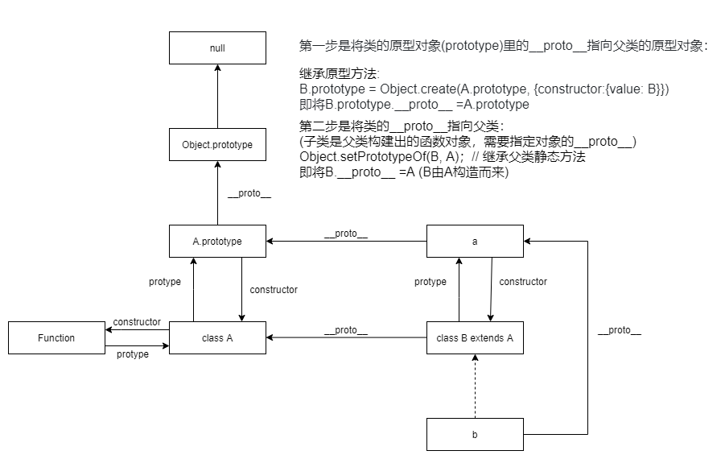

# [ES6里Class的Extends继承原理](https://segmentfault.com/a/1190000021306417)

JS的原型链继承的本质是根据__proto__一层一层往上找
继承的时候只需要把子类的原型对象prototype里的__proto__属性指向父类的prototype即可

```js
  class A {
    constructor(name = "A") {
      this.name = name;
    }
    getName = () => {
      return this.name;
    };
  }

  class B extends A {
    constructor() {
      super("B");
    }
  }

  let b = new B();
```

