# 1. 谈谈你对 `MVVM` 的理解

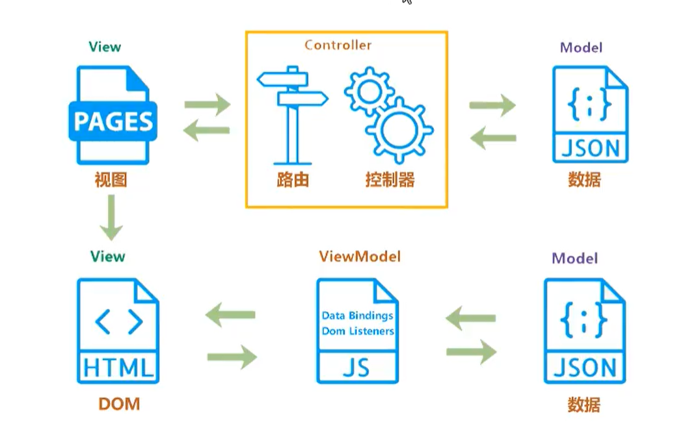

- 传统的 `MVC` 指的是, 用户操作会请求服务器路由, 路由会调用对应的控制器来处理, 控制器会获取数据,将结果返回给前端, 页面会重新渲染;
  - 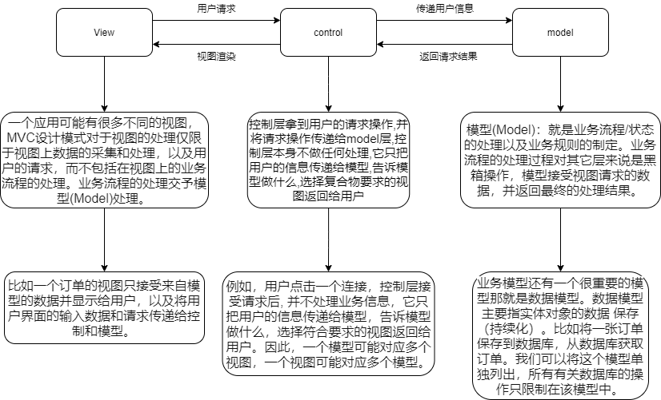
- `MVVM`: 传统的前端会将数据手动渲染到页面上, `MVVM`模式不需要用户收到操作 dom 元素, 将数据绑定到`viewModel`层上, 会自动将数据渲染到页面中, 视图变化会通知`viewModel`层更新数据, `viewModel`就是我们`MVVM`模式的桥梁.

# 2. 请说下响应式数据的原理

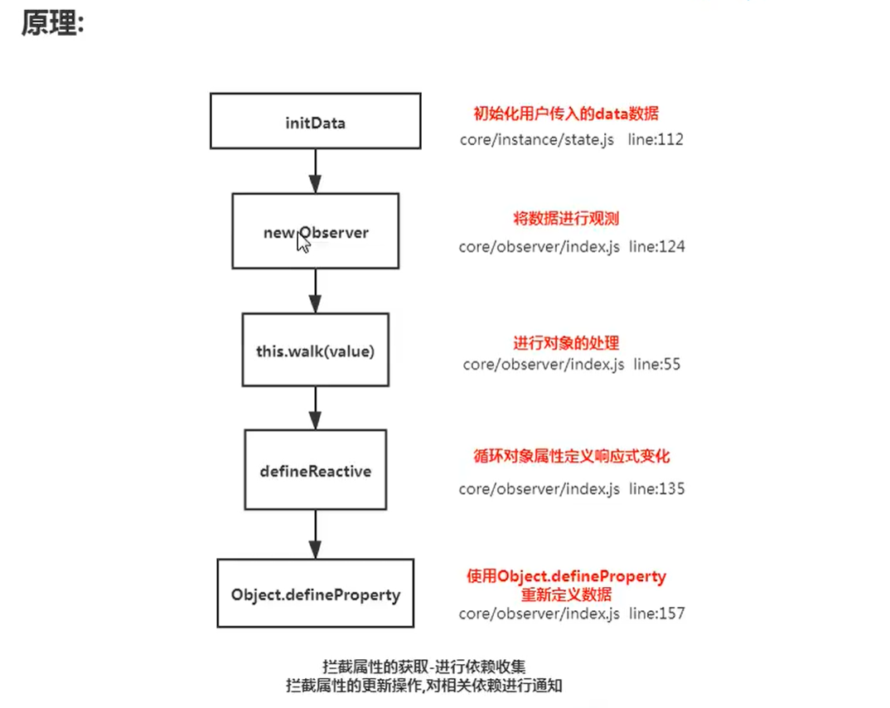

```js

        Object.defineProperty(obj, key, {    
            enumerable: true,    
            configurable: true,    
            get: function reactiveGetter () {      
                const value = getter ? getter.call(obj) : val      
                if (Dep.target) {        
                    dep.depend() // ** 收集依赖 ** /        
                    if (childOb) {          
                        childOb.dep.depend()          
                        if (Array.isArray(value)) {            
                            dependArray(value)          
                        }        
                    }      
                }      
                return value    
            },    
            set: function reactiveSetter (newVal) {      
                const value = getter ? getter.call(obj) : val      
                if (newVal === value || (newVal !== newVal && value !== value)) {        
                    return      
                }      
                if (process.env.NODE_ENV !== 'production' && customSetter) {        
                    customSetter()      
                }
                    val = newVal      
                    childOb = !shallow && observe(newVal)      
                    dep.notify() /**通知相关依赖进行更新**/    
            }  
        })
```


# 3. `vue` 中如何检测数组变化

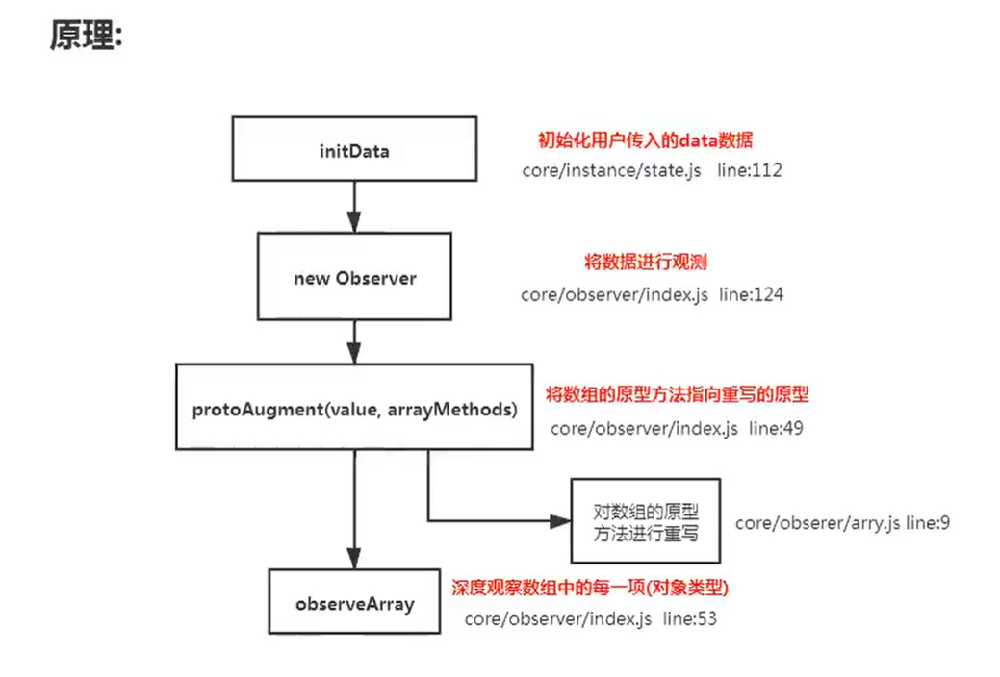

```js
const arrayProto = Array.prototype 
    export const arrayMethods = Object.create(arrayProto) 
    const methodsToPatch = [  'push',  'pop',  'shift',  'unshift',  'splice',  'sort',  'reverse' ] 
    methodsToPatch.forEach(function (method) { // 重写原型方法  const original = arrayProto[method] 
        // 调用原数组的方法  
        def(arrayMethods, method, function mutator (...args) {    
            const result = original.apply(this, args)    
            const ob = this.__ob__    
            let inserted
        switch (method) {      
            case 'push':      
            case 'unshift':        
            inserted = args        
            break      
            case 'splice':        
            inserted = args.slice(2)        
            break    
        }    
        if (inserted) ob.observeArray(inserted)    // notify change    
        ob.dep.notify() // 当调用数组方法后，手动通知视图更新    
        return result  
        }) 
    })
    this.observeArray(value) // 进行深度监控

```


# 4. 为何 `vue` 采用异步渲染

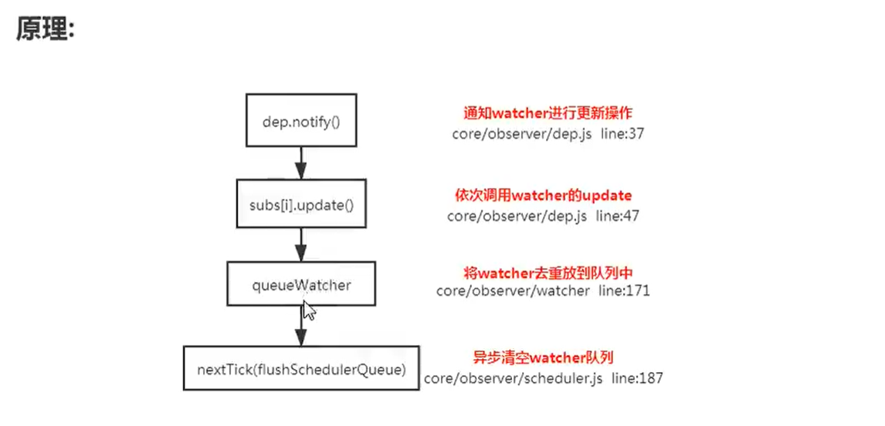

```js
 update () {    /* istanbul ignore else */    
        if (this.lazy) {      
            this.dirty = true    
            } else if (this.sync) {      
                this.run()    
            } else {     
                queueWatcher(this); // 当数据发生变化时会将watcher放到一个队列中批量更新   
            }
    } 
    export function queueWatcher (watcher: Watcher) {  
            const id = watcher.id // 会对相同的watcher进行过滤  
            if (has[id] == null) {    
                has[id] = true    
                if (!flushing) {      
                    queue.push(watcher)    
                    } else {      
                        let i = queue.length - 1      
                        while (i > index && queue[i].id > watcher.id) {        
                            i--     
                        }      
                        queue.splice(i + 1, 0, watcher)   
                        }    
                        // queue the flush    
                        if (!waiting) {     
                             waiting = true
                             if (process.env.NODE_ENV !== 'production' && !config.async) {        
                                flushSchedulerQueue()        
                                return      
                                }      
                                nextTick(flushSchedulerQueue) // 调用nextTick方法 批量的进行更新    
                        }  
                } 
    }

```


# 5. `nextTick` 实现原理

**理解:(宏任务和微任务) 异步方法** 
`nextTick`方法主要是使用了宏任务和微任务,定义了一个异步方法.多次调用` nextTick` 会将方法存入 队列中，通过这个异步方法清空当前队列。 所以这个 nextTick 方法就是异步方法

Vue 在观察到数据变化时并不是直接更新 DOM，而是开启一个队列（微任务），去更新 DOM 。 所以如果你用一个for循环来动态改变数据100次，其实它只会应用最后一次改变，如果没有这种机制，DOM就要重绘100次。（Vue.js使用异步更新队列更新DOM）

$nextTick 接收一个回调函数作为参数，它的作用是将回调延迟到下次 DOM 更新周期之后执行。将回调函数放入异步队列中。Vue会根据当前浏览器环境优先使用原生的 Promise.then、 MutationObserver 和 setImmediate, 如果都不支持，就会采用 setTimeout 替换。

在 vue2.5 的源码中，macrotask 降级的方案依次是：setImmediate、MessageChannel、setTimeout

vue 的 nextTick 方法的实现原理:

- vue 用异步队列的方式来控制 DOM 更新和 nextTick 回调先后执行
- microtask 因为其高优先级特性，能确保队列中的微任务在一次事件循环前被执行完毕
- 考虑兼容问题, vue 做了 microtask 向 macrotask 的降级方案

```js
  //模拟 nextTick
  const callbacks = [];
  //变量控制 microTimerFunc 一次事件循环中只执行一次。
  let pending = false;
  function flushCallbacks(){
      pending = false;
      const copies = callbacks.slice(0);
      callbacks.length = 0;
      for(let i = 0;i < copies.length; i++){
          copies[i]()
      }
  }
  let microTimerFunc;
  const p = Promise.resolve();
  microTimerFunc = ()=>{
      // 开启微任务队列
      p.then(flushCallbacks)
  }
  function nextTick(cb, ctx){
      callbacks.push(()=>{
          if(cb){
              cb.call(ctx)
          }
      })
      // 开始是false 第一次push事件后 pending为true 一次循环事件中只执行一次
      if(!pending){
          pending = true;
          microTimerFunc()
      }
  }
  //测试一下
  nextTick(function(){
      console.log(this.name);
  }, {name: 'Berwin'});
  console.log("start...");
  nextTick(function(){
      console.log(this.name);
  }, {name: 'lisi'});

```

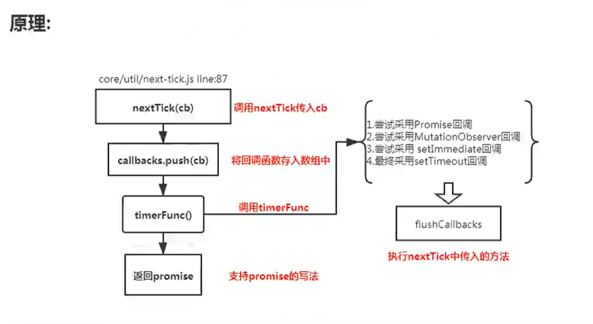

```js
  let timerFunc  // 会定义一个异步方法
        if (typeof Promise !== 'undefined' && isNative(Promise)) {  // promise  
        const p = Promise.resolve()  
        timerFunc = () => {    
            p.then(flushCallbacks)    
        if (isIOS) setTimeout(noop)  
        }  
            isUsingMicroTask = true 
        } else if (!isIE && typeof MutationObserver !== 'undefined' && ( // MutationObserver  
        isNative(MutationObserver) ||  MutationObserver.toString() === '[object MutationObserverConstructor]' )) {  
            let counter = 1  
            const observer = new MutationObserver(flushCallbacks)  
            const textNode = document.createTextNode(String(counter))  
            observer.observe(textNode, {    characterData: true  })  
        timerFunc = () => {    
            counter = (counter + 1) % 2    
            textNode.data = String(counter)  }  
            isUsingMicroTask = true 
        } else if (typeof setImmediate !== 'undefined' ) { // setImmediate  
        timerFunc = () => {    
            setImmediate(flushCallbacks)  
        } } else {  timerFunc = () => {   // setTimeout    
        setTimeout(flushCallbacks, 0)  } } // nextTick实现 
        export function nextTick (cb?: Function, ctx?: Object) {  
            let _resolve  
            callbacks.push(() => {    
                if (cb) {      
                    try {        
                        cb.call(ctx)      
                    } catch (e) {        
                        handleError(e, ctx, 'nextTick')      
                    }    
                } else if (_resolve) {      
                    _resolve(ctx)    
                }  
            })  
            if (!pending) {    
                pending = true    
                timerFunc()  
            } 
        }
```


# 6. `vue` 中 `computed` 的特点

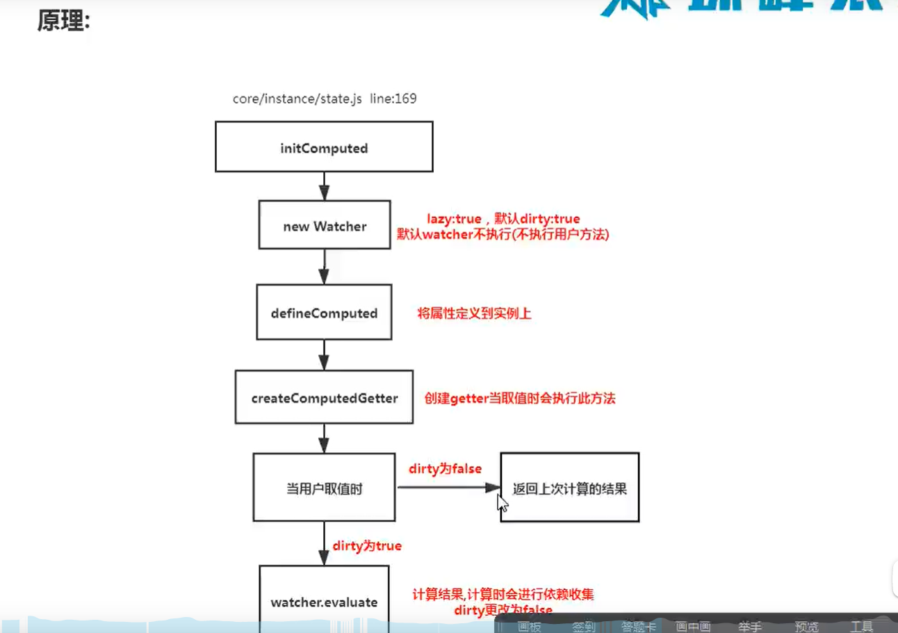

```js
 function initComputed (vm: Component, computed: Object) {  
            const watchers = vm._computedWatchers = Object.create(null)  
            const isSSR = isServerRendering()  for (const key in computed) {    
                const userDef = computed[key]    
                const getter = typeof userDef === 'function' ? userDef : userDef.get    
                if (!isSSR) {      // create internal watcher for the computed property.      
                watchers[key] = new Watcher(        vm,        getter || noop,        noop,        
                computedWatcherOptions      )    }
                 // component-defined computed properties are already defined on the    
                // component prototype. We only need to define computed properties defined
                // at instantiation here.    
                if (!(key in vm)) {      
                    defineComputed(vm, key, userDef)    
                } else if (process.env.NODE_ENV !== 'production') {      
                    if (key in vm.$data) {        
                        warn(`The computed property "${key}" is already defined in data.`, vm)      
                    } else if (vm.$options.props && key in vm.$options.props) {        
                        warn(`The computed property "${key}" is already defined as a prop.`, vm)     
                    }   
                }  
            }
        } 
        function createComputedGetter (key) {  
            return function computedGetter () {    
                const watcher = this._computedWatchers && this._computedWatchers[key]    
                if (watcher) {      
                    if (watcher.dirty) { // 如果依赖的值没发生变化,就不会重新求值        
                        watcher.evaluate()      
                    }      
                    if (Dep.target) {        
                        watcher.depend()      
                    }      
                    return watcher.value    
                }  
            } 
        }
```


# 7. `watch` 中的 `deep:true` 是如何实现的

**理解:** 
当用户指定了 watch 中的deep属性为 true 时，如果当前监控的值是数组类型。会对对象中的每 一项进行求值，此时会将当前 watcher 存入到对应属性的依赖中，这样数组中对象发生变化时也 会通知数据更新

```js
  get () {    
            pushTarget(this) // 先将当前依赖放到 Dep.target上    
            let value    
            const vm = this.vm    
            try {      
                value = this.getter.call(vm, vm)   
            } catch (e) {      
                if (this.user) {        
                    handleError(e, vm, `getter for watcher "${this.expression}"`)      
                } else {        
                    throw e      
                }    
            } finally {      
                if (this.deep) { // 如果需要深度监控        
                    traverse(value) // 会对对象中的每一项取值,取值时会执行对应的get方法      
                }      
                    popTarget()  
            }
            return value 
        } 
        function _traverse (val: any, seen: SimpleSet) {  
            let i, keys 
            const isA = Array.isArray(val)  
            if ((!isA && !isObject(val)) || Object.isFrozen(val) || val instanceof VNode) {    
                return 
            }  
            if (val.__ob__) {    
                const depId = val.__ob__.dep.id    
                if (seen.has(depId)) {      
                    return    
                }    
                seen.add(depId) 
            }  
            if (isA) {    
                i = val.length    
                while (i--) _traverse(val[i], seen)  
            } else {    
            keys = Object.keys(val)    
            i = keys.length    
            while (i--) _traverse(val[keys[i]], seen)  
            } 
        }
```


# 8. `vue` 组件的生命周期

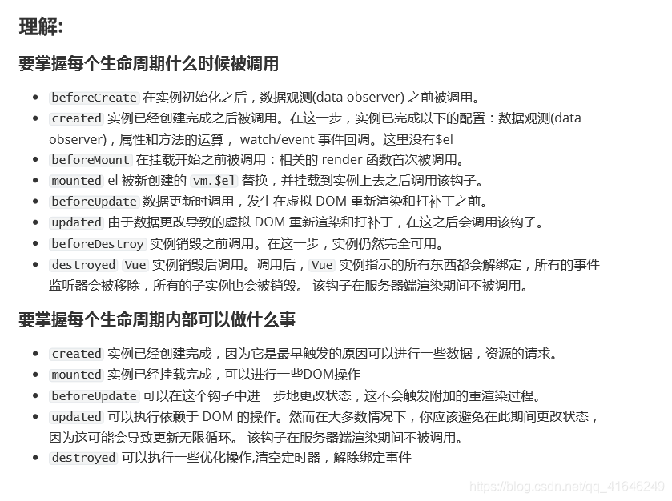

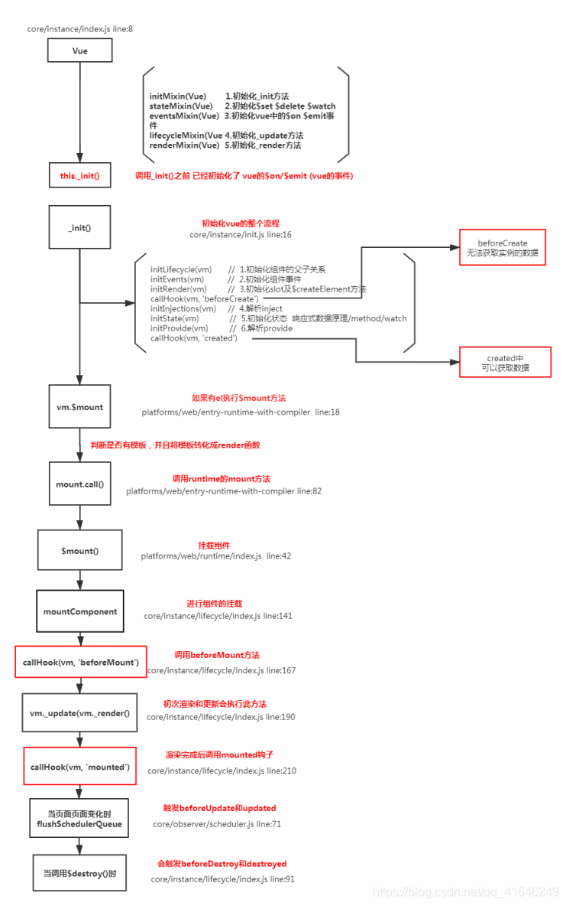

# 9. `ajax`请求放到哪个生命周期中

**理解**

- 在created的时候,视图中的dom并没有渲染出来,所以此时如果直接去操作dom, 无法找到相关元素
- 在mounted中, 由于此时dom已经渲染出来了, 所以可以直接操作dom节点
- 一般情况下都放到mounted中, 保证逻辑同意向, 因为生命周期是同步执行的, ajax是异步执行的
- `服务端渲染(ssr)`不支持mounted方法, 因为服务端渲染没有dom, 服务端渲染把页面渲染成字符串变成dom返回, 所以在服务端渲染的情况下统一放到created中

# 10. 什么时候需要使用`beforeDestory`

**理解**

- 可能在当前页面中使用了`$on`方法, 那需要在组件销毁之前解绑
- 清除自定义的定时器
- 解除事件的绑定

# 11. `vue`中模板编译原理

将 template 转化成 render 函数

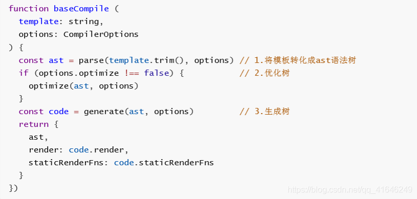

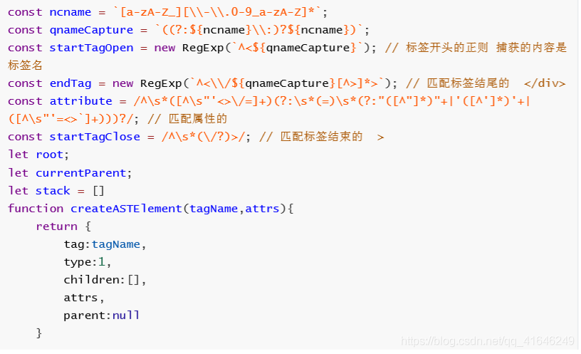

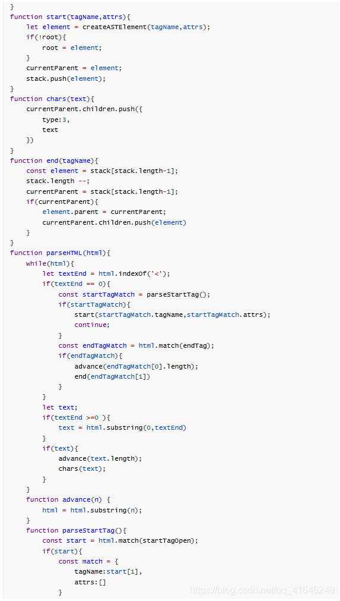

# 12. `vue`中`v-if`和`v-show`的区别

**理解**

- v-if是不会渲染domyuansu
- v-show是切换当前dom的显示和隐藏

**原理**

```js
const VueTemplateCompiler = require('vue-template-compiler')
let r1 = VueTemplateCompiler.compile(`<div v-if="true"><span v-for="i in 3">hello</span></div>`)
console.log(r1)

function render() {
  with(this) {
    return (true) ? _c('div', _l((3), function (i) {
      return _c('span', [_v("hello")])
    }), 0) : _e()
  }
}
```

```js
const VueTemplateCompiler = require('vue-template-compiler')
let r2 = VueTemplateCompiler.compile(`<div v-show="true"><span v-for="i in 3">hello</span></div>`)
console.log(r2)

function render() {
  with(this) {
    return _c('div', {
      directives: [{
        name: "show",
        rawName: "v-show",
        value: (true),
        expression: "true"
      }]
    }, _l((3), function (i) {
      return _c('span', [_v("hello")])
    }), 0)
  }
}
```

# 13. 为什么`v-for`和`v-if`不能连用

**理解**

```js
const VueTemplateCompiler = require('vue-template-compiler')
let r1 = VueTemplateCompiler.compile(`<span v-if="false" v-for="i in 3">hello</span>`)
console.log(r1.render)

function render() {
  with(this) {
    return _c('div', _l((3), function (i) {
      return (false) ? _c('span', [_v("hello")]) : _e()
    }), 0)
  }
}
```

- `v-for`会比`v-if`的优先级更高一些,如果连用的话会把`v-if`给每个元素都添加一下, 会造成性能问题

# 14. 使用`VNode`描述`DOM`结构

- 虚拟节点就是用一个对象来描述真实的`dom`元素
- `template`模板 `ast`树 => `codegen` => 转换成`render`函数 => 内部调用的就是`_c`方法 =>虚拟`dom`
- [ast与前端工程化实战](http://www.imooc.com/article/290884)

```js
function $createElement(tag, data, ...children){
    let key = data.key;
    delete data.key;
    children = children.map(child=>{
        if(typeof child === 'object'){
            return child
        }else{
            return vnode(undefined,undefined,undefined,undefined,child)
        }
    })
    return vnode(tag, data, key, children)
}
export function vnode(tag, data,key,children, text){
	return {
        tag,/* 当前的标签名 */
        data,/* 当前标签上的属性 */
        key,/* 唯一表示 用户可能传递 */
        children,/* 子节点 */
        text, /* 文本节点 */
    }
}
```

# 15. `diff`算法的时间复杂度

**理解**

两个树的完全的diff算法是一个时间复杂度为o(n3), Vue进行了优化, O(n3)复杂度的问题转换为o(n)复杂度的问题(只比较同级别不考虑跨级问题), 在前端中 ,你很少会跨越层级的移动DOM元素, 所以Virtual Dom只会对同一个层级的元素进行对比.

# 16. 简述`vue`中`diff`算法原理

**理解**

- 先同级别比较, 在比较节点
- 先判断一方有儿子, 一方没有儿子的情况
- 比较都有儿子的情况
- 递归比较子节点

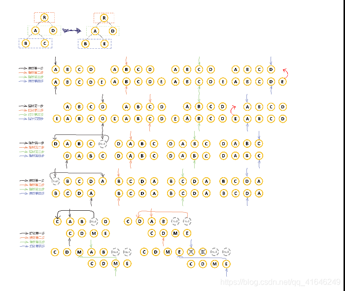

# 17. `v-for`中为什么要用`key`

**理解**

就地复用原则

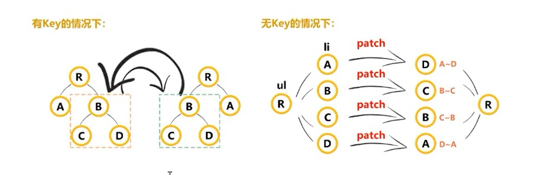

# 18. 描述组件渲染和更新的过程

**理解**

- 渲染组件时, 会通过`Vue.extend`方法构建子组件的构造函数, 并进行实例化. 最终手动调用`$mount`进行挂载. 更新组件时会进行`patchVnode`流程, 核心就是`diff`算法

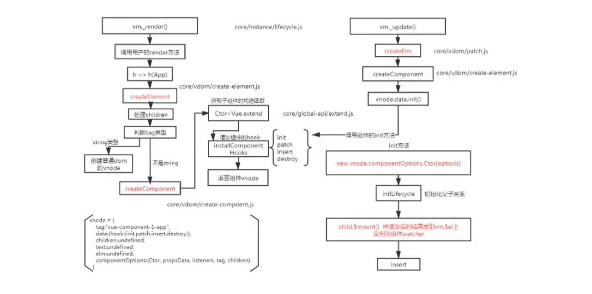

# 19. `组件`中的`data`为什么是一个函数

```js
function VueComponent() {}
VueCompoent.prototype.$options = {
    data: {name:'zf'}
}
let v1 = new VueComponent()
v1.$options.data = '1';
let v2 = new VueComponent()
console.log(v2.$options.data)
```

**理解**

- 同一个`组件被复用`多次,会创建多个实例. 这些实例用的是同一个构造函数, 如果`data`是一个对象的话 , 那么所有组件都共享同一个对象, 为了保证组件的数据独立性要求每个组件必须通过`data`函数返回一个对象作为组件的状态.
- 一个组件被使用多次, 用的都是同一个构造函数, 为了保证组件的不同的实例data不冲突, 要求data必须是一个函数, 这样组件间不会相互影响
- `core/global-api/extend.js line:33`

**原理**

`core/global-api/extend.js line 33`

# 20. vue中事件绑定的原理

vue的事件绑定分为两种一种是原生的事件绑定, 还有一种是组件的事件绑定

**理解**

- 原生`dom`事件绑定, 采用的是`addEventListener`实现
- 组件上的`@click.native` 等价于`dom`元素上的`@click` , `vue` 组件内部通过`data.nativeOn`等价于普通的`data.on`
- 组件绑定事件采用的是`$on`方法, 所以我们可以在组件内部通过`$emit`方法触发组件上的方法

**原理**

- `vdom/create-component.js`
- `src/platforms/web/runtime/modules/events.js`
- 事件的编译是

```js
let compiler = require('vue-template-compiler')
let r1 = compiler.compile('<div @click="fn()" />')
let r2 = compiler.compile('<my-component @click.native="fn()" @click="fn()" />')

console.log(r1.render)

function render() {
  with(this) {
    return _c('div', {
      on: {
        "click": function ($event) {
          return fn()
        }
      }
    })
  }
}

console.log(r2.render)

function render() {
  with(this) {
    return _c('my-component', {
      on: {
        "click": function ($event) {
          return fn()
        }
      },
      nativeOn: {
        "click": function ($event) {
          return fn()
        }
      }
    })
  }
}
```

- 事件代理

```html
// 这样会有性能问题
<div v-for="i in 100">
	<div @click="fn" />    
</div>

// 通过事件代理 事件冒泡解决问题
<div @click="fn">
 <div v-for="i in 100">
	<div />    
 </div>
</div>
```


# 21. `v-model`的实现原理以及如何自定义`v-model`

`v-model`可以看成是`value+input`方法的语法糖

**理解**

- 组建的`v-model`就是`value+input`的语法糖

```html
<el-checkbox :value="" @input="" />
<el-checkbox v-model="check" />
```
  - 可以自己重新定义`v-model`含义, 可以去vue官网看方法具体使用
  - ` core/vdom/create-component.js line:155`
  - 原生的`v-model`会根据标签的不同生成不同的事件和属性, 并且在`runtime`阶段会生成响应的指令
  - `src/platforms/web/compiler/directives/model.js line:37`
  - `src/platforms/web/runtime/directives/model.js`

```js
const VueTemplateCompiler = require('vue-template-compiler')
const ele = VueTemplateCompiler.compile('<input type="checkbox" v-model="value" />')

function render() {
  with(this) {
    return _c('input', {
      directives: [{
        name: "model",
        rawName: "v-model",
        value: (value),
        expression: "value"
      }],
      attrs: {
        "type": "checkbox"
      },
      domProps: {
        "checked": Array.isArray(value) ? _i(value, null) > -1 : (value)
      },
      on: {
        "change": function ($event) {
          var $$a = value,
            $$el = $event.target,
            $$c = $$el.checked ? (true) : (false);
          if (Array.isArray($$a)) {
            var $$v = null,
              $$i = _i($$a, $$v);
            if ($$el.checked) {
              $$i < 0 && (value = $$a.concat([$$v]))
            } else {
              $$i > -1 && (value = $$a.slice(0, $$i).concat($$a.slice(
                $$i + 1)))
            }
          } else {
            value = $$c
          }
        }
      }
    })
  }
}
```

# 22.`vue`中的`v-html`会导致哪些问题

**理解**

- 可能会导致`xss`攻击

```html
<input v-model="msg"/>
<div v-html="msg"/>
```

- `v-html`会替换掉标签内部的子元素
- `src/pathforms/web/runtime/modules/dom-props.js`

**原理**

```js
const VueTemplateCompiler = require('vue-template-compiler')
let r = VueTemplateCompiler.compile('<div v-html="'<span>hello</span>'" />')

console.log(r)

// _c 定义在 core/instance/render.js
// _s 定义在 core/instance/render-helpers/index.js
```

# 23.`vue`父子组件生命周期调用顺序 

**理解**

- 组件的调用顺序都是先父后子, 渲染完成的顺序肯定是先子后父
- 组件的销毁操作是先父后子, 销毁完成的顺序是先子后父

# 24. `vue`的组件通信

- $on, $emit `src/core/instance/events.js`
- $parent, $children, $root
- event bus
- provide inject `src/core/instance/inject`
- vuex
- $attrs, $listeners
- ref

# 25. `vue`中相同逻辑如何抽离

- `Vue.mixin`用法给组件每个周期, 函数等都混入一些公共逻辑

# 26. 为什么要使用异步组件

**理解**

- 如果组件功能多打包出的结果会变大, 我可以采用异步的方式来加载组件. 主要依赖`import()`语句, 可以实现文件的分割加载

```js
components: {
    AddCustomerSchedule: (resolve) => import('./components/AddCustomer')
}
```

# 27. 什么是作用域插槽

**理解**

- 插槽
  - 创建组件虚拟节点时, 会将组件的儿子的虚拟节点保存起来, 当初始化组件时, 通过插槽将儿子进行分类`{a:[vnode], b:[vnode]}`
  - 渲染组件时会拿对应的slot属性的节点进行替换操作.(插槽的作用域为父组件)
- 作用域插槽
  - 作用域插槽在解析的时候, 不会作为组件的孩子节点. 会解析成函数, 当子组件渲染时, 会调用次函数进行渲染 (插槽的作用域为子组件)


# 28. 谈谈你对`keep-alive`的理解

- `src/core/components/keep-alive.js`

# 29. `vue`常见的性能优化

- 编码优化
  - 不要将所有的数据都放在data中, data中的数据都会增加getter和setter, 回收集对应的watcher
  - vue在v-for时给每个元素绑定事件需要事件代理
  - SPA页面采用keep-alive缓存组件
  - 拆分组件(提高复用性, 增加代码可维护性, 减少不必要的渲染(vue是组件级别的渲染))
  - v-if值为false时, 内部指令不会执行, 具有阻断功能, 很多情况下使用v-if代替v-show
  - key保证唯一性(默认vue会采用就地复用的策略)
  - object.freeze冻结数据
  - 合理的使用路由懒加载, 异步组件
  - 尽量采用runtime运行时的版本
  - 数据持久化的问题(防抖,节流, 尽量减少重复性操作)
- `vue`加载性能优化
  - 第三方模块按需导入(`babel-plugin-component`)
  - 滚动到可视区域动态加载(https://tangbc.github.io/vue-virtual-scroll-list)
  - 图片懒加载(https://github.com/hilongjw/vue-lazyload.git)
- 用户体验
  - `app-skeleton` 骨架屏
  - `app-shell` app壳
  - `pwa`
- `SEO`优化
  - 预渲染插件 `prerender-spa-plugin`
  - 服务端渲染`ssr`
- 打包优化
  - 使用`cdn`的方式加载第三方模块
  - 多线程打包`happypack`
  - `splitChunks`抽离公共文件
  - `sourceMap`的生成
- 缓存, 压缩
  - 客户端缓存, 服务端缓存
  - 服务端`gzip`压缩

# 30. 其他

- 双向绑定和vuex是否冲突
- vue中内置组件transition, transition-group实现原理
- 说说patch函数里做了啥
- 知道vue的生命周期内部怎么实现的
- ssr项目如果并发很大服务器怎么优化
- 说下项目中怎么实现权限校验
- 将vue-lazyloader的原理, 手写伪代码
- vue.set的原理
  - `src/core/observer/index.js line:200`
- vue.compile过程详细说一下, 指令, 插值表达式 等vue语法如何生效的


# 参考链接

1. [vue面试题你必须掌握到这种程度](https://www.bilibili.com/video/BV11E411x74r?p=4)
2. [2020年3月份最新vue面试题汇总一](https://blog.csdn.net/qq_41646249/article/details/104644647?utm_medium=distribute.pc_relevant.none-task-blog-BlogCommendFromMachineLearnPai2-1.add_param_isCf&depth_1-utm_source=distribute.pc_relevant.none-task-blog-BlogCommendFromMachineLearnPai2-1.add_param_isCf)