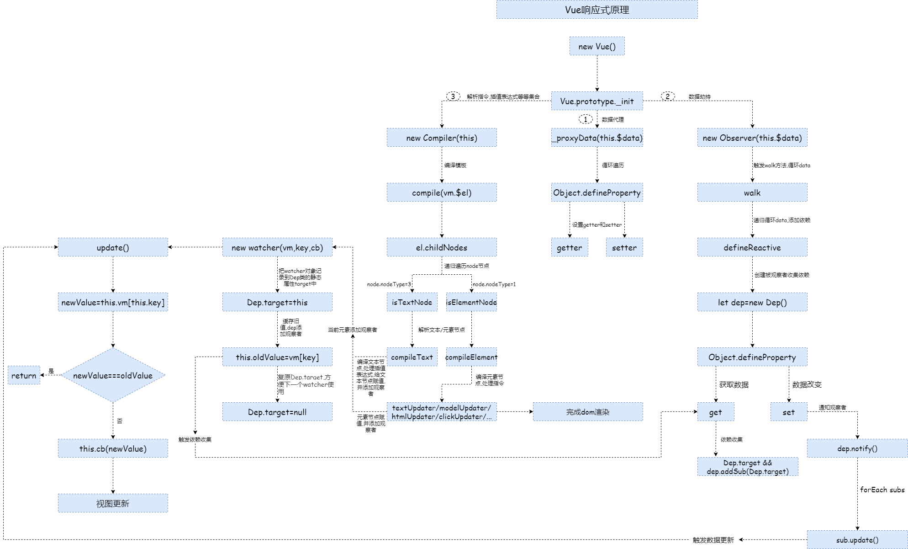
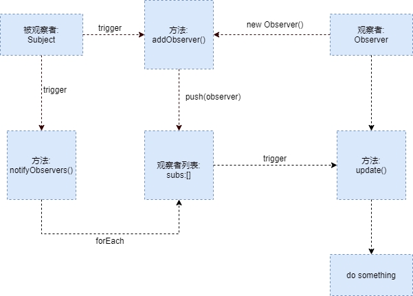

# 从设计模式理解 Vue 响应式（多图警告）



### 序言

近日公司开发一个拖拽表单项目，用到了 Vue，部门老大便开始研读 Vue 源码，并且传授给我们，老大说，读源码不能仅仅只看懂源码，还得读懂他的设计思想，他为什么要这么设计，把自己当做设计者来读，这样才能真正理解，本文中，我会按照老大的指引方向，和自己的理解，来谈一谈 Vue 响应式原理，及其设计思想

### 什么是Vue响应式

官方解释： Vue 最独特的特性之一，是其非侵入性的响应式系统。数据模型仅仅是普通的 JavaScript 对象。而当你修改它们时，视图会进行更新 ，简单说就是数据发生改变视图会做出相应的更新，视图发生变化，例如 input 输入，数据也会做出对应的变化。

### 响应式的原理及其设计模式

Vue 响应式所使用的设计模式，是**观察者模式**，观察者模式通俗的说就是， 例如：郭老师每天上班带一个橙子，我想在他吃橙子的时候蹭一口，但是我又不想一直盯着郭老师看他什么时候吃，于是我和郭老师说，你吃橙子的时候通知我，然后等郭老师吃橙子的时候，我收到消息，立马就做出我想要做的事情（蹭一口） 这样做可以省去了反复检索的资源消耗，也得到更高的反馈速度。

 

1. 观察对象 (Subject)：拥有两个必要标识，通知当前实例所拥有的观察者的方法。给当前实例添加观察者的方法。
2. 观察者（Observer）：拥有一个必要标识，通知实例更新状态的方法。

联系方式：

1. 观察对象 (Subject) 通过自己内部的通知函数，调用所有观察者列表中所有观察者对应的回调函数，达到通知观察者的目的。
2. 观察者（Observer）通过调用观察者对象（Subject）中的添加方法，把自己回调函数传入他的观察者列表中。

### 响应式和观察者模式的融合

我们先来看一下实现一个基础的Vue需要哪些文件，我们以尤大的[miniVue](https://github.com/yzycool/miniVue)作为探讨的demo。

我们先来一一介绍一下这些文件分别做了什么功能；

1. Vue 是事件总线文件，他会将对象描述文本中的 data 数据拿出来，然后通过 _proxyData 函数，将 data 所有数据进行劫持，劫持过后的数据会有两个方法，getter 和 setter 。getter 在读取时触发，用于添加依赖。setter在赋值时触发，用于通知更新 。
2. observer 文件，这里的 walk 方法，通过递归遍历 data 中的每一个属性。然后在 defineReactive 中给每个属性创建一个新的 Dep ，用于存储自身的依赖（观察者），Object.defineProperty 响应式的根本，如果是触发的get，就把他的 Dep.target 添加到 Dep 列表，这一步也就是收集依赖，你取了我的说明你对我感兴趣，所以我把你添加进我的观察者俩表，如果触发set，说明数据发生改变，触发dep中的notify，通知所有观察者，有数据更新了，快行动。
3. dep 文件是观察者模式中的观察对象（Subject），里面拥有一个储存观察中的容器，和添加观察者，通知观察者的方法。
4. compiler 文件是一个处理文件，专门用来处理解析指令，差值表达式，等等的集合。
5. watcher 文件是观察者模式中的观察者，里面有一个更新视图的方法，和调用dep中添加观察者的方法。

#### 小结

由上面文件的基本描述可知，Vue 的响应式，运用了观察者模式，他拥有一个观察对象 dep.js ，一个观察者 watcher.js ，在 watcher.js 中会将观察者添加进 dep 中的观察者列表，在 dep 发送通知时，会接收消息，然后触发自身内的更新视图方法，如此一来，利用观察者模式实现了响应式。

### Vue实例初始化

#### 我们逐一来看下这三个步骤的源码

1. 首先是进入口文件 vue.js 。通过 `defineProperty` 完成了 Data 中所有数据的代理。

```javascript
class Vue {
    constructor (options) {
        // 1.通过数据存储数据
        this.$options = options || {} // save options
        this.$el = typeof options.el === 'string' ? document.querySelector(options.el)
        :options.el // get dom
        this.$data = options.data // get data
        this.$methods = options.methods
        // 2.设置属性的 setter 与 getter 方法
        this._proxyData(this.$data)
        // 3.调用observe对象，监听数据变化
        new Observer(this.$data)
        // 4.调用compiler对象，解析指令和差值表达式
        new Compiler(this)
    }
    _proxyData (data) {
        // 遍历所有data
        Object.keys(data).forEach(key => {
            // 将data属性注入到vue中
            Object.defineProperty(this, key, {
                enumerable: true,
                configurable: true,
                get () {
                    return data[key]
                },
                set (newValue) {
                    if (data[key] === newValue) {
                        return
                    }
                    data[key] = newValue
                }
            })
        })
    }
}

复制代码
```

1. 然后进入 Observe.js ，遍历所有数据，如果是get则收集依赖，如果是set则发送通知

```javascript
class Observer {
    constructor(data) {
        this.walk(data)
    }
    walk (data) { // 循环执行data
        if (!data || typeof data !== 'object') {
            return
        }
        Object.keys(data).forEach(key => {
            this.defineReactive(data, key, data[key])
        })
    }
    defineReactive (obj, key, val) { 
        let that = this
        this.walk(val) // 如果val是对象，则给他绑定get和set时触发的方法
        let dep = new Dep() // 负责收集依赖，并发送通知
        Object.defineProperty(obj, key, {
            configurable: true,
            enumerable: true,
            get() {
                Dep.target && dep.addSub(Dep.target) // 收集依赖
                return val // 如果使用obj[key]，会变成死循环
            },
            set(newValue) {
                if (newValue === val) {
                    return
                }
                val = newValue
                that.walk(newValue) // 修改后可能是对象，set函数内部调用，修改了this指向
                dep.notify() // 发送通知
            }
        })
    }
}
复制代码
```

小结：这个文件是响应式的实现，使用了一个 walk 方法，通过递归遍历 data 中的每一个属性，然后在放进 defineReactive 中给每个对象创建一个新的 Dep ，用于存储自身的依赖（观察者），然后将对象的可读和可写属性打开，并且定义一个 set 和 get 触发时的方法。 如果是触发的 get ，就把他的 Dep.target 添加到 Dep 列表，这一步也就是收集依赖，你取了我的说明你对我感兴趣，所以我把你添加进我的观察者列表。如果触发 set ，说明数据发生改变，触发 dep 中的 notify ，通知所有观察者，有数据更新了，快行动，以此达成响应式。

1. 然后进入 watcher.js 。这里通过一个 Dep 类的静态属性 target ，用来记录当前 watcher 对象，通过使用其中的属性，触发 get ，使自身依赖添加进观察者列表，形成了观察者模式，然后复原Dep.target,方便下一个Watcher使用。在接收到观察对象的通知后，调用自身的更新方法，完成视图更新。

```javascript
class Watcher {
    constructor (vm, key, cb) {
        this.vm = vm
        // data中的属性名称
        this.key = key
        // 回调函数负责更新视图
        this.cb = cb
        // 把watcher对象记录到Dep类的静态属性target
        Dep.target = this
        // 触发get方法，在get方法中会调用addSub
        this.oldValue = vm[key]
        Dep.target = null
    }
    // 当数据发生变化的时候更新视图
    update () {
        let newValue = this.vm[this.key]
        if (this.oldValue === newValue) {
            return
        }
        this.cb(newValue)
    }
}
复制代码
```

我们最后来看一下初始化流程图


按照箭头得知：首先初始化阶段做了三个步骤：

1. 调用 vue.js 中的 _proxyData 进行数据劫持。
2. 进入 Observe.js ，创建 Dep（观察目标），所有他拥有一个储存观察者列表的容器，和添加观察者，通知观察者的方法。
3. 创建 Watcher （观察者） ，他是观察者模式中的观察者，所以他拥有一个通知更新的响应方法。

小结：这三个步骤是 Vue 响应式的核心，也是观察者模式的实现，Watcher（观察者）通过触发 get ，将自身添加进观察目标的观察者列表。Dep 通过遍历自身观察者列表实现通知所有观察者，从而实现响应式。

### 视图渲染和视图更新

我们来看看 compiler.js 文件的主要内容

1. compile ：编辑模板
2. compileElement ：编译元素节点
3. compileText ：编译文本节点，处理差值表达式

```javascript
// 解析 v-model
    modelUpdater (node, value, key) {
        node.value = value
        new Watcher(this.vm, key, (newValue) => { // 创建watcher对象，当数据改变更新视图
            node.value = newValue
        })
        // 双向绑定
        node.addEventListener('input', () => {
            this.vm[key] = node.value
        })
    } 
// 编译模板
    compile (el) {
        let childNodes = el.childNodes
        Array.from(childNodes).forEach(node => {
            if (this.isTextNode(node)) { // 处理文本节点
                this.compileText(node)
            }   else if(this.isElementNode(node)) { // 处理元素节点
                this.compileElement(node)
            }
            // 如果还有子节点，递归调用
            if (node.childNodes && node.childNodes.length > 0) {
                this.compile(node)
            }
        })
    }
    // 编译元素节点，处理指令
    compileElement (node) {
        // console.log(node.attributes)
        if (node.attributes.length) {
            Array.from(node.attributes).forEach(attr => { // 遍历所有元素节点
                let attrName = attr.name
                if (this.isDirective(attrName)) { // 判断是否是指令
                    attrName = attrName.indexOf(':') > -1 ? attrName.substr(5) : attrName.substr(2) // 获取 v- 后面的值
                    let key = attr.value // 获取data名称
                    this.update(node, key, attrName)
                }
            })
        }
    }
 // 编译文本节点，处理差值表达式
    compileText (node) {
        // 获取 {{  }} 中的值
        // console.dir(node) // console.dir => 转成对象形式
        let reg = /\{\{(.+?)\}\}/
        let value = node.textContent
        if (reg.test(value)) {
            let key = RegExp.$1.trim() // 返回匹配到的第一个字符串，去掉空格
            node.textContent = value.replace(reg, this.vm[key])
            new Watcher(this.vm, key, (newValue) => { // 创建watcher对象，当数据改变更新视图
                node.textContent = newValue
            })
        }
    }
复制代码
```

我们再看一幅路程图


小结：compile 把元素转换为 vnode 对象，然后遍历 vnode 对象，根据标识分为元素节点，文本节点，数据三个分类，分别进入不同的处理函数，并且创建一个 Watcher 对象，然后在 Watcher 对象中触发 get 实现响应式，同步会进行 updata 更新数据，转换成真实 dom ，完成页面渲染，更新就是如此反复。

### 整体响应式运行流程图

 最后，我们根据这张流程图进行一下知识回顾。 首先是初始化三步走：

1. 通过 _proxyData 进行数据劫持，对 Data 进行代理，
2. 创建 Dep（观察目标）对象，
3. 然后创建 Watcher （观察者）对象，

然后开始渲染阶段

1. vm.render（）触发后进行模板编译
2. complie（template）将元素编译成 vnode 对象，遍历该对象，创建 Watcher ，添加依赖完成响应式。
3. updata 更新数据，然后转化成真实 dom，完成渲染。

# 文章链接

1. [从设计模式理解 Vue 响应式(多图警告)](https://juejin.cn/post/6922276550004080653?utm_source=gold_browser_extension)